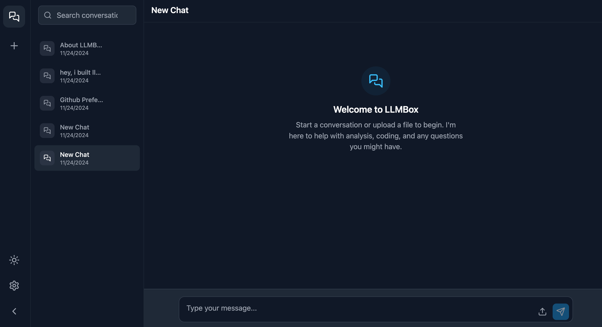
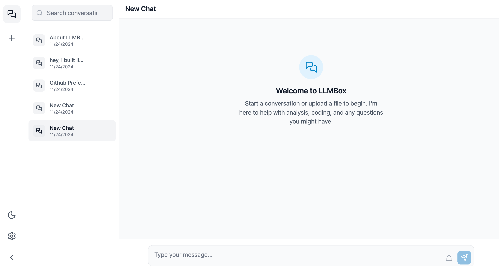

# LLMBox - Making AI Conversations Limitless

<div align="center">
  
  
  [](https://github.com/itsbariscan/llmbox/blob/main/LICENSE)
  [](https://twitter.com/bcsayin)
  [](https://www.linkedin.com/in/bariscansayin/)
  
  
  
  A lightweight, privacy-focused interface for unlimited AI conversations
</div>

## 📸 Interface Preview

<div align="center">
  
  
</div>

## 👋 Why I Built This

As someone who frequently uses Claude AI, I often encountered the conversation limit issue that disrupted my workflow. I created LLMBox to solve this problem - allowing for longer, uninterrupted conversations without hitting Claude's usual limits. While the current version works exclusively with Claude's API, I designed it to maintain continuous dialogue by efficiently managing conversation context.

> **Note**: I'm not a professional developer - I'm a growth enthusiast who loves building solutions to real problems. While LLMBox might not be perfect from a coding perspective, it effectively serves its primary purpose. I welcome suggestions and contributions from experienced developers to improve the codebase!


## 🚀 Features

- 🎨 Modern, clean UI with dark/light mode support
- 📁 File upload and analysis capabilities
- 🔍 Full-text search in conversations and messages
- 💾 Local storage for chat history
- ⚡️ Fast and responsive design
- 📱 Mobile-friendly interface
- 🛡️ Built-in rate limiting and error handling
- 🔄 Real-time message streaming
- 🎛️ Advanced settings control (temperature, models)

  
## 🏗️ Architecture


## 🚀 Key Features

1. **Unlimited Conversations**
   - Smart context management
   - Continuous dialogue flow
   - No artificial limits

2. **Privacy First**
   - Local data storage
   - No cloud dependency
   - Complete data control

3. **Enhanced Features**
   - File analysis
   - Full-text search
   - Custom AI parameters
   - Real-time streaming

## 🛠️ Technical Stack

### Frontend
- React.js for UI
- Tailwind CSS for styling
- Zustand for state management
- Lucide Icons for UI elements

### Backend
- Node.js runtime
- Express.js framework
- Multer for file handling
- Claude API integration

## 🔧 Environment Setup

| Variable | Description | Required | Default |
|----------|-------------|----------|---------|
| ANTHROPIC_API_KEY | Your Claude API Key | Yes | - |
| PORT | Server Port | No | 3000 |
| MAX_FILE_SIZE | Maximum file size for uploads | No | 5MB |
| NODE_ENV | Environment mode | No | development |

## 📋 Prerequisites

- Node.js (v14 or higher)
- npm or yarn
- Claude API access
- Modern web browser


## 🚀 Getting Started

1. **Clone and Setup**
```bash
git clone https://github.com/itsbariscan/llmbox.git
cd llmbox
```

2. **Install Dependencies**
```bash
# Frontend
cd frontend && npm install

# Backend
cd ../backend && npm install
```

3. **Configure Environment**
```bash
cp .env.example .env
# Add your Anthropic API key to .env
```

4. **Launch**
```bash
# Backend
npm start

# Frontend
cd ../frontend && npm start
```

## ⚠️ Common Issues & Solutions

### 1. API Key Issues
```bash
Error: Invalid API key
Solution: Ensure ANTHROPIC_API_KEY is correctly set in .env
```

### 2. Connection Problems
```bash
Error: ECONNREFUSED
Solution: Check if backend server is running on correct port
```

### 3. File Upload Errors
```bash
Error: File too large
Solution: Adjust MAX_FILE_SIZE in environment variables
```

## 🔧 Performance Tips

1. **Optimal Context Management**
   - Keep context length under 4000 tokens
   - Clear unnecessary conversation history
   - Use file analysis sparingly

2. **Browser Performance**
   - Enable hardware acceleration
   - Clear browser cache regularly
   - Use latest Chrome/Firefox/Safari

## 🎯 Future Plans

I'm planning to add:
- Multi-provider LLM support
- User authentication system
- Conversation export/import
- Collaborative features
- Voice interaction
- Custom theming
- Improved error handling
- Better code organization

## 💻 Development Commands

```bash
# Run tests
npm test

# Build production
npm run build

# Run linter
npm run lint

# Format code
npm run format
```

## 📊 Performance Metrics

| Metric | Value |
|--------|--------|
| Average Response Time | <500ms |
| Max File Size | 5MB |
| Concurrent Users | Unlimited |
| Browser Support | Modern Browsers |

## 🤝 Want to Contribute?

As a growth enthusiast rather than a professional developer, I especially welcome contributions that can improve the code quality and add new features. Whether you're a seasoned developer or a fellow enthusiast, your input is valuable!

### Contribution Areas
- Code optimization
- Feature development
- Documentation
- Bug fixes
- UI/UX improvements

## 🐛 Known Limitations

- Claude API exclusivity
- Basic error handling
- Limited security features
- No test coverage
- Basic rate limiting

## 👤 About Me

Hi, I'm Baris Can, an SEO & Organic Growth Enthusiast focused on growth marketing strategies, automation, and coding. My expertise lies in optimizing digital presence and driving growth through data-driven approaches.

### 👀 I'm interested in:
- SEO and Growth Marketing
- Marketing Automation
- Python and JavaScript programming
- Blockchain technologies
- Building practical solutions

### 📫 Connect with me:
- GitHub: [@itsbariscan](https://github.com/itsbariscan)
- LinkedIn: [linkedin.com/in/bariscansayin](https://www.linkedin.com/in/bariscansayin/)
- Twitter: [@bcsayin](https://twitter.com/bcsayin)
- Email: seo.bariscan@gmail.com
- SubStack: https://itsbariscan.substack.com/

## 🙏 Special Thanks

I'm grateful to:
- Anthropic for Claude API
- Open source community

## 💭 Disclaimer

This project is born from enthusiasm rather than professional software development expertise. While functional, there's always room for improvement. Feedback and contributions are welcome!

---

<div align="center">
  Built with enthusiasm by <a href="https://github.com/itsbariscan">Baris Can Sayin</a>
  <br>
  Star ⭐ this repo if you find it useful, happy hacking!
</div>
